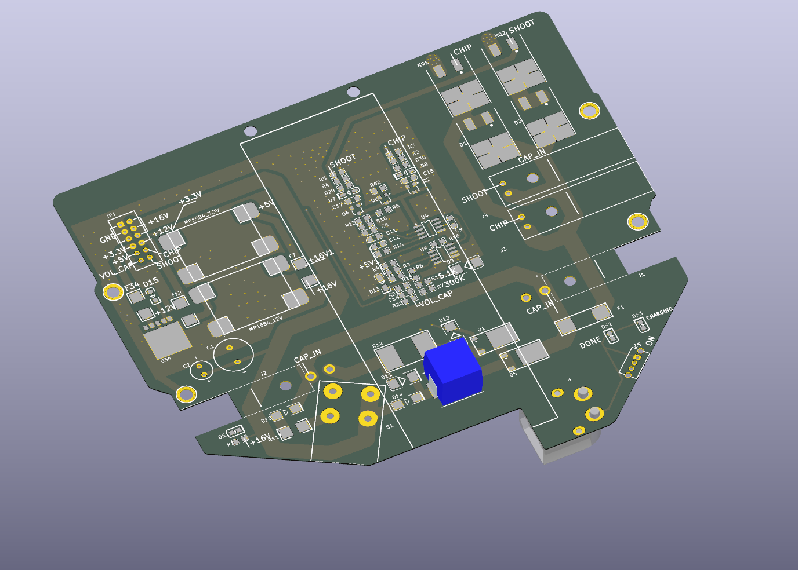

# Placa de chute — ZJUNlict Booster Board

Conversão do arquivo `Booster_Board-master.zip` fornecido pela equipe em 26/09/2026. Projeto original em Altium Designer, importado no KiCad 9.0.7 e exportado para STEP. Este é um modelo de referência mecânica **parcial**, não uma montagem completa nem um projeto de fabricação revisado.

## Arquivos

- [Modelo STEP parcial](zjunlict-booster-board-partial.step): placa e os quatro componentes que tinham modelos 3D incorporados e associados a footprints no projeto.
- [STEP da placa nua](zjunlict-booster-board-bare.step): substrato, contorno e furações exportadas.
- [Layout editável no KiCad](zjunlict-booster-board.kicad_pcb), com os modelos incorporados, e [configurações do projeto](zjunlict-booster-board.kicad_pro).
- [Prévia do KiCad](preview.png): mostra também cobre e serigrafia; os STEP finais omitem essas camadas visuais.

## O que foi recuperado

Foram importados 86 footprints. Quatro têm modelos 3D: `L2` (MSS1210-683MED), `C19` e `C20` (T523H477M016APE0707280) e `Designator1` (modelo denominado `power connector.STEP`). Os outros 82 footprints não têm modelos 3D associados na conversão. Sua presença no layout ou na serigrafia não significa que seu volume esteja representado no STEP.

Logo, a altura total calculada do STEP parcial **não é a altura máxima da placa montada**. Módulos MP1584, conectores, chave, capacitores e outros componentes visíveis nas fotos precisam de modelos e posições conferidos antes de validar interferências com o robô.

## Contorno mecânico

A forma de placa armazenada no campo de board shape do Altium é um polígono quase retangular, diferente do contorno recortado da placa fotografada. O desenho da camada `Mechanical 1` corresponde visualmente à foto da versão 2019 e foi usado para gerar o `Edge.Cuts` deste derivado.

O desenho mecânico original continha pequenos desencontros entre segmentos. Na cópia de trabalho foram removidos um segmento duplicado e um segmento de comprimento praticamente zero, unidos dois segmentos verticais sobrepostos, e ajustadas 26 extremidades de retas para fechar o contorno. O deslocamento máximo foi **0,311254 mm**, dentro da tolerância de agrupamento de 0,35 mm. Os arcos originais foram preservados. O contorno resultante contém 28 retas, 10 arcos e dois círculos de furos. O desenho `Mechanical 1` permanece no arquivo para comparação.

Isso é uma reconstrução do desenho fornecido, não uma medição da peça fabricada. Conferir contorno, posições dos furos e pequenas tolerâncias com a placa real antes de fabricar suportes. O arquivo original não foi alterado.

## Dimensões e validação

Ambos os STEP finais foram reabertos no FreeCAD 1.1.1 e passaram em `Shape.isValid()`, inclusive todos os sólidos individualmente.

| Arquivo | Sólidos | Envelope X × Y × Z (mm) |
| --- | ---: | --- |
| Placa nua | 1 | 147,70795 × 129,08513 × 0,32116 |
| Montagem parcial | 11 | 147,70795 × 129,08513 × 19,51116 |

O KiCad importou **0,41116 mm de espessura nominal de placa**. O STEP sem cobre exporta um substrato de **0,32116 mm**; a diferença vem das camadas externas omitidas pelo exportador. A espessura é incomum para este tipo de placa e precisa ser confirmada fisicamente. Ela foi preservada, sem assumir 1,6 mm. Os dados de empilhamento do Altium também contêm valores muito finos (núcleo de 12,6 mil e cobre de 1,4 mil por face).

O importador emitiu avisos `Unexpected Layer ID`; o resultado foi inspecionado para referência mecânica, não validado eletricamente ou para fabricação. A primeira exportação com cobre/serigrafia não passou na validação geométrica e não está incluída nesta pasta. Os STEP finais foram exportados sem esses elementos e passaram na validação.

## Reprodução da exportação

Na pasta deste projeto, com KiCad 9:

```sh
kicad-cli pcb export step -o booster-partial.step zjunlict-booster-board.kicad_pcb
kicad-cli pcb export step --board-only -o booster-bare.step zjunlict-booster-board.kicad_pcb
```

Na instalação Snap, substituir `kicad-cli` por `kicad.kicad-cli`. Para inspecionar, abrir o `.kicad_pcb` no PCB Editor e usar o visualizador 3D (`Alt+3`).

## Procedência

- Projeto: [ZJUNlict/Booster_Board](https://github.com/ZJUNlict/Booster_Board), versão 2019 conforme README do arquivo fornecido. As capturas 3D de 2018 também estão no ZIP e não representam a revisão 2019 completa.
- Revisão registrada no comentário do ZIP: `d5fa47cd16713b73b239209bb32c646890c3a289`.
- SHA-256 do ZIP fornecido: `a4ba0fe5ceaa91873fa818f8d310cfb279b4cea9df956c15c5282f4afe0ac4c7`.
- As fontes Altium estão no ZIP original; esta pasta contém o derivado KiCad e as exportações mecânicas. O arquivo `.kicad_pcb` incorpora os modelos 3D utilizados na exportação.


